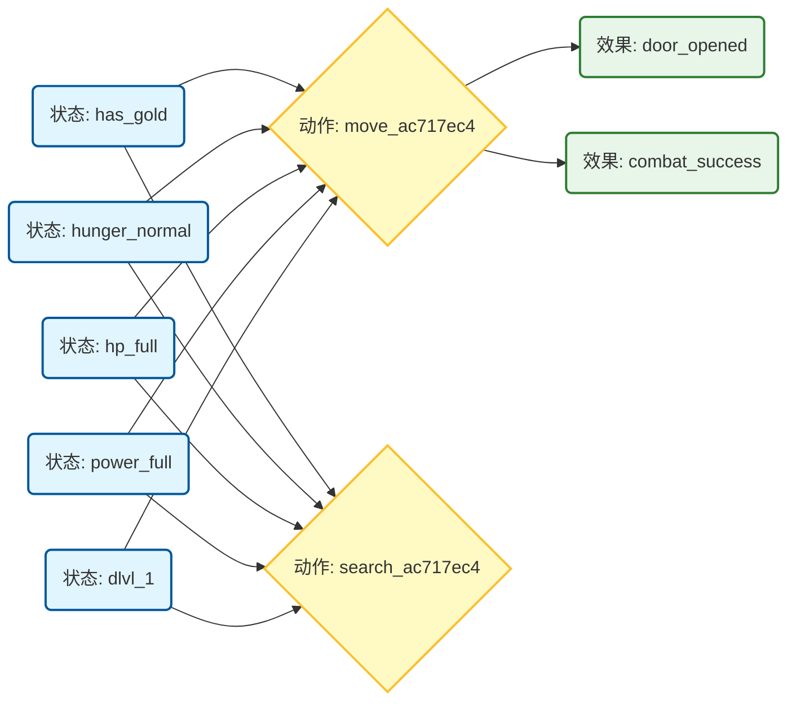

前置升级：超图结构的重新设计 (Prerequisite)
你的原始设计是 if (pre) then (eff) 的扁平列表。GAT 的核心是消息传递（Message Passing）。如果每条超边是独立的，GAT 就退化成了 MLP。为了让 GAT 发挥作用，节点必须共享，形成拓扑结构。
新超图设计建议：状态-动作流转图 (State-Action Flow Hypergraph)
* 节点 (Nodes) 分为三类：
    1. Condition Nodes (状态原子): 如 has_gold, hp_low, near_monster。这些是图的“输入”。
    2. Operator Nodes (动作/算子): 如 move, attack, eat。这是图的“枢纽”。
    3. Effect Nodes (结果预期): 如 hunger_satisfied, door_opened。这是图的“输出”。
* 边 (Edges)：
    * 不再是孤立的 JSON 对象，而是共享节点的网状结构。
    * 例如：hp_low (Node) 同时连接到 drink_potion (Op) 和 pray (Op)。
* GAT 的作用：
    * 当观测到 hp_low 亮起时，GAT 会把这个“激活信号”传导给 drink_potion 和 pray，这两个 Operator 节点的 Embedding 会变热（Heatmap 高亮），而 attack 节点因为前置条件不满足（或权重低）而变冷。


具体描述与结构如下

为了让你能直接上手写代码，我将从 **JSON 数据结构** 的层面，给你最具体的**字段对比**。

我们要做的转变是：从 **“以规则为核心 (Rule-Centric)”** 转变为 **“以图为核心 (Graph-Centric)”**。

---

### 1. 旧结构：孤岛式 (The Flat List)

**特点**：以 `hyperedges`（超边/规则）作为顶层单位。数据会有大量冗余。
**GAT 的痛点**：解析时，你很难知道第一条规则里的 `hp_low` 和第二条规则里的 `hp_low` 是同一个东西。

```json
// OLD_hypergraph.json
{
  "hyperedges": [
    // 规则 1：没血了就喝药
    {
      "id": "rule_drink_01",
      "operator": "drink_potion", 
      "pre_nodes": [ "hp_low", "has_potion", "inventory_not_empty" ], // "hp_low" 出现第1次
      "eff_nodes": [ "hp_recovered", "potion_consumed" ]
    },
    // 规则 2：没血了就祈祷
    {
      "id": "rule_pray_01",
      "operator": "pray",
      "pre_nodes": [ "hp_low", "god_happy", "turn_safe" ], // "hp_low" 出现第2次
      "eff_nodes": [ "hp_recovered", "god_angry" ]
    }
  ]
}

```

> **问题**：在这里，`hp_low` 是两个独立的字符串。如果你直接把这个喂给网络，网络会认为这是两个无关的特征。你必须写一大堆预处理代码来做去重（Deduplication）。

---

### 2. 新结构：拓扑式 (The Shared Topology)

**特点**：以 `nodes`（节点注册表）和 `adjacency`（邻接关系）为顶层单位。这是 **PyTorch Geometric (PyG)** 最喜欢的格式。
**GAT 的爽点**：`hp_low` 全局只有一个 ID。

```json
// NEW_hypergraph.json
{
  // 1. 全局节点注册表 (Global Registry)
  // 所有的状态、动作、效果都混在一起，拥有唯一的 index
  "nodes": [
    { "id": 0, "name": "hp_low",       "type": "condition" }, // 唯一的 hp_low
    { "id": 1, "name": "has_potion",   "type": "condition" },
    { "id": 2, "name": "god_happy",    "type": "condition" },
    
    { "id": 3, "name": "drink_potion", "type": "operator" },  // 动作 A
    { "id": 4, "name": "pray",         "type": "operator" },  // 动作 B
    
    { "id": 5, "name": "hp_recovered", "type": "effect" }
  ],

  // 2. 邻接关系 (Topology / Edges)
  // 定义谁流向谁。这里只存 ID。
  // 格式：[Source_ID, Target_ID]
  "edges": [
    // 规则 1 的连线 (hp_low -> drink)
    [0, 3], 
    [1, 3], 
    [3, 5], // drink -> hp_recovered

    // 规则 2 的连线 (hp_low -> pray)
    // 注意：这里复用了 ID 0，实现了图的连通！
    [0, 4], 
    [2, 4],
    [4, 5]  // pray -> hp_recovered (复用了 ID 5)
  ]
}

```

---

### 3. 代码实现的巨大差异

为了让你更有实感，我写一段伪代码，展示在 Python 中构建 PyG Data 对象的区别。

#### 旧结构的处理逻辑 (繁琐)

你需要在内存里动态维护一个 `set` 来去重。

```python
# 旧方式：边读边建图，很痛苦
unique_nodes = {}
node_counter = 0
edges = []

for rule in old_json['hyperedges']:
    op_name = rule['operator']
    # 你得手动检查 'drink_potion' 以前是不是见过
    if op_name not in unique_nodes:
        unique_nodes[op_name] = node_counter
        node_counter += 1
    
    op_idx = unique_nodes[op_name]
    
    for pre in rule['pre_nodes']:
        # 你又得检查 'hp_low' 以前是不是见过
        if pre not in unique_nodes:
            unique_nodes[pre] = node_counter
            node_counter += 1
        
        pre_idx = unique_nodes[pre]
        edges.append([pre_idx, op_idx]) # 建立连接

```

#### 新结构的处理逻辑 (丝滑)

直接加载，这就是 GAT 需要的 `edge_index`。

```python
# 新方式：直接映射
import torch
from torch_geometric.data import Data

# 1. 节点特征 (Node Features)
# 假设你已经把每个 node type 转换成了 One-Hot 或者 Embedding
x = load_node_features(new_json['nodes']) 

# 2. 边索引 (Edge Index)
# 直接读取 JSON 里的 edges 列表，转置一下即可
edge_index = torch.tensor(new_json['edges'], dtype=torch.long).t().contiguous()

# 3. 构建 PyG 数据对象
# 这就可以直接丢进 GAT 模型里跑了
data = Data(x=x, edge_index=edge_index)

```

### 4. 字段设计的核心建议

在你重构 JSON 时，请务必添加以下字段，这会让你的 GAT 训练事半功倍：

1. **`nodes` 里的 `type` 字段**：
* 你需要告诉 GAT 哪些节点是“状态”（输入），哪些是“动作”（中间处理），哪些是“后果”（输出）。
* 在代码里，你会根据 `type` 给节点赋予不同的初始 Embedding。


2. **`edges` 里的 `relation_type` (可选但推荐)**：
* 如果是 **Heterogeneous Graph (异构图)**，你可以区分边的类型。
* 例如：`pre_condition` (状态->动作) 和 `leads_to` (动作->后果) 可以是两种不同的边。
* *字段示例*：`"edges": [ [0, 3, "pre_condition"], [3, 5, "leads_to"] ]`


### 总结

* **旧字段**：面向人类阅读，像自然语言的句子（IF...THEN...）。
* **新字段**：面向矩阵计算，像数据库的关系表（ID...Reference...）。


GAT角度PyG
import json
import torch
from torch_geometric.data import Data

def load_graph_data(json_file):
    with open(json_file, 'r') as f:
        graph_data = json.load(f)
    
    # 1. 提取边索引 (Edge Index)
    # PyG 需要 [2, num_edges] 的 tensor
    src = [e[0] for e in graph_data['edges']]
    dst = [e[1] for e in graph_data['edges']]
    edge_index = torch.tensor([src, dst], dtype=torch.long)
    
    # 2. 提取边类型 (可选，用于 R-GAT)
    # 简单的映射: satisfies=0, context_of=1, leads_to=2
    rel_map = {"satisfies": 0, "context_of": 1, "leads_to": 2}
    edge_attr = torch.tensor([rel_map[e[2]] for e in graph_data['edges']], dtype=torch.long)
    
    # 3. 初始化节点特征 (Node Features)
    # 这里通常用 Embedding 层初始化
    # x = torch.arange(len(graph_data['nodes'])) # 仅仅是ID
    
    return Data(edge_index=edge_index, edge_attr=edge_attr, num_nodes=len(graph_data['nodes']))

# 测试加载
data = load_graph_data('hypergraph_gat_ready.json')
print(data)


示例转化代码

```python
import json

# Parsing the provided JSON content directly
json_content = """
{
  "meta": {
    "version": "2.0",
    "total_hyperedges": 450,
    "total_operators": 33,
    "total_variants": 204
  },
  "hyperedges": [
    {
      "id": "HE_move_ac717ec4",
      "operator": "move",
      "variant": "ac717ec4",
      "pre_nodes": [
        "has_gold",
        "hunger_normal",
        "confused",
        "hallucinating",
        "hp_full",
        "power_empty",
        "no_gold",
        "blind",
        "stunned",
        "power_full"
      ],
      "scene_atoms": [
        "dlvl_1",
        "ac_poor",
        "in_shop",
        "near_altar",
        "monsters_present",
        "ac_good",
        "exp_1"
      ],
      "eff_nodes": [
        "ate_food",
        "hunger_satisfied",
        "locked",
        "hit",
        "combat_success",
        "missing_item",
        "missed",
        "door_opened",
        "action_blocked",
        "killed",
        "got_gold",
        "destroyed"
      ]
    },
    {
      "id": "HE_search_ac717ec4",
      "operator": "search",
      "variant": "ac717ec4",
      "pre_nodes": [
        "has_gold",
        "hunger_normal",
        "hp_full",
        "power_empty",
        "no_gold",
        "power_full"
      ],
      "scene_atoms": [
        "dlvl_1",
        "ac_poor",
        "in_shop",
        "near_altar",
        "monsters_present",
        "ac_good",
        "exp_1"
      ],
      "eff_nodes": []
    }
  ]
}
"""

data = json.loads(json_content)
hyperedges = data.get('hyperedges', [])

# Registry to keep unique nodes
node_registry = {}
next_node_id = 0
nodes = []
edges = []

def get_or_create_node(name, node_type):
    global next_node_id
    key = f"{node_type}:{name}"
    if key not in node_registry:
        node = {"id": next_node_id, "label": name, "type": node_type}
        node_registry[key] = node
        nodes.append(node)
        next_node_id += 1
    return node_registry[key]

# Process a few examples to show the user
for he in hyperedges: # processing first few from the snippet
    # 1. Operator Node
    op_name = f"{he['operator']}_{he['variant']}"
    op_node = get_or_create_node(op_name, "operator")
    
    # 2. Conditions (Pre-nodes)
    for pre in he.get('pre_nodes', []):
        pre_node = get_or_create_node(pre, "condition")
        edges.append({"source": pre_node['id'], "target": op_node['id'], "relation": "satisfies"})
        
    # 3. Conditions (Scene)
    for scene in he.get('scene_atoms', []):
        scene_node = get_or_create_node(scene, "condition")
        edges.append({"source": scene_node['id'], "target": op_node['id'], "relation": "context_of"})
        
    # 4. Effects
    for eff in he.get('eff_nodes', []):
        eff_node = get_or_create_node(eff, "effect")
        edges.append({"source": op_node['id'], "target": eff_node['id'], "relation": "leads_to"})

# Display the extracted graph elements
print(f"Total Nodes: {len(nodes)}")
print(f"Total Edges: {len(edges)}")
print("\n--- Nodes (Sample) ---")
for n in nodes[:10]:
    print(n)

print("\n--- Edges (Sample) ---")
for e in edges[:10]:
    print(e)


```

```text
Total Nodes: 31
Total Edges: 42

--- Nodes (Sample) ---
{'id': 0, 'label': 'move_ac717ec4', 'type': 'operator'}
{'id': 1, 'label': 'has_gold', 'type': 'condition'}
{'id': 2, 'label': 'hunger_normal', 'type': 'condition'}
{'id': 3, 'label': 'confused', 'type': 'condition'}
{'id': 4, 'label': 'hallucinating', 'type': 'condition'}
{'id': 5, 'label': 'hp_full', 'type': 'condition'}
{'id': 6, 'label': 'power_empty', 'type': 'condition'}
{'id': 7, 'label': 'no_gold', 'type': 'condition'}
{'id': 8, 'label': 'blind', 'type': 'condition'}
{'id': 9, 'label': 'stunned', 'type': 'condition'}

--- Edges (Sample) ---
{'source': 1, 'target': 0, 'relation': 'satisfies'}
{'source': 2, 'target': 0, 'relation': 'satisfies'}
{'source': 3, 'target': 0, 'relation': 'satisfies'}
{'source': 4, 'target': 0, 'relation': 'satisfies'}
{'source': 5, 'target': 0, 'relation': 'satisfies'}
{'source': 6, 'target': 0, 'relation': 'satisfies'}
{'source': 7, 'target': 0, 'relation': 'satisfies'}
{'source': 8, 'target': 0, 'relation': 'satisfies'}
{'source': 9, 'target': 0, 'relation': 'satisfies'}
{'source': 10, 'target': 0, 'relation': 'satisfies'}


```

这里是为您提取的绘制**拓扑结构示意图**（Topological Graph）所需的**核心要素**。

既然您想要“画图”，我为您准备了三个层面的信息：

1. **Mermaid 代码**：您可以直接复制到 Markdown 编辑器（如 Notion, Obsidian）中生成的**可视化图表**。
2. **节点与连线数据表**：用于理解图的具体构成。
3. **Python 脚本**：您可以直接运行它，将您完整的 `hypergraph_complete_real.json` 转换为图数据。

---

### 1. 可视化示意图 (Mermaid Code)

这是一个基于您数据中前两条规则 (`move` 和 `search`) 生成的**真实子图**。
请注意观察 **`hp_full` (满血)** 节点是如何同时连接两个动作的，这就是**GAT**所需的“节点共享”结构。



---

### 2. 核心数据要素表 (Data Elements)

如果您要手绘或使用其他工具（如 Gephi），请使用以下逻辑：

#### **A. 节点 (Nodes)**

| ID | 类型 (Type) | 标签示例 (Label) | 含义 |
| --- | --- | --- | --- |
| **0** | **Condition** | `hp_full`, `has_gold` | **输入层**。这是图的“感知末梢”，根据游戏状态点亮。 |
| **1** | **Operator** | `move_ac717ec4` | **隐藏层/枢纽**。这是每条规则的唯一标识。GAT在此处聚合信息。 |
| **2** | **Effect** | `door_opened` | **输出层/预测**。代表动作的预期结果，用于因果推理。 |

#### **B. 连线 (Edges)**

| 源节点 (Source) | 目标节点 (Target) | 关系类型 (Relation) | 物理含义 |
| --- | --- | --- | --- |
| Condition | Operator | `satisfies` (满足) | “因为满血(Pre)，所以能移动(Op)” |
| SceneAtom | Operator | `context_of` (场景) | “在第一层(Scene)，适合移动(Op)” |
| Operator | Effect | `leads_to` (导致) | “移动(Op) 会导致 门开了(Eff)” |

---

### 3. 全量转换脚本 (Python)

由于您的文件有 450 条规则，手动画是不可能的。
请在您的本地环境运行这段代码，它会将您的 `hypergraph_complete_real.json` 清洗为标准的 **节点(Nodes) + 边(Edges)** 列表。

```python
import json

def generate_graph_data(input_file):
    with open(input_file, 'r', encoding='utf-8') as f:
        data = json.load(f)

    node_registry = {}  # 用于去重：{"hp_full": 0, "move_xyz": 1}
    edges = []          # 存储连线：[(0, 1), (2, 1)...]
    
    next_id = 0

    def get_id(name):
        nonlocal next_id
        if name not in node_registry:
            node_registry[name] = next_id
            next_id += 1
        return node_registry[name]

    for rule in data.get("hyperedges", []):
        # 1. 获取中心节点 (Operator)
        op_name = f"{rule['operator']}_{rule['variant']}"
        op_id = get_id(op_name)

        # 2. 连接前置条件 -> Operator
        for pre in rule.get("pre_nodes", []) + rule.get("scene_atoms", []):
            pre_id = get_id(pre)
            edges.append( (pre_id, op_id) )  # 建立边

        # 3. 连接 Operator -> 效果
        for eff in rule.get("eff_nodes", []):
            eff_id = get_id(eff)
            edges.append( (op_id, eff_id) )  # 建立边

    print(f"提取完成！共 {len(node_registry)} 个唯一节点，{len(edges)} 条连线。")
    return node_registry, edges

# 使用方法：
# nodes, edges = generate_graph_data('hypergraph_complete_real.json')

```